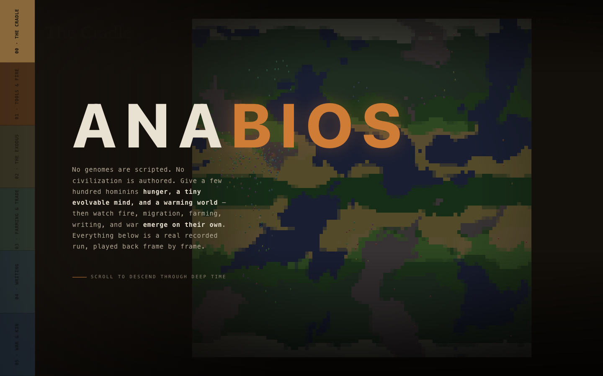
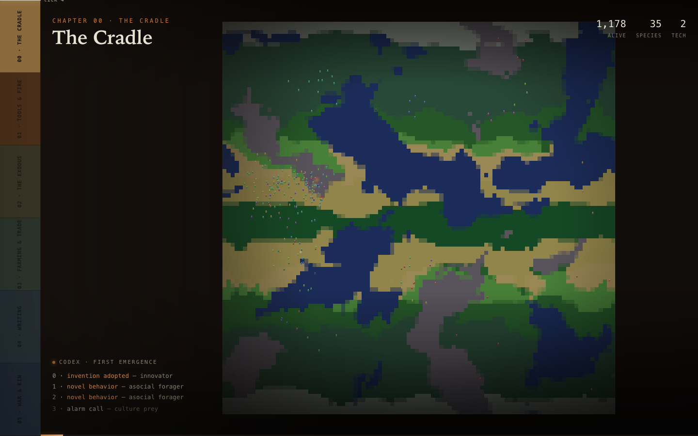
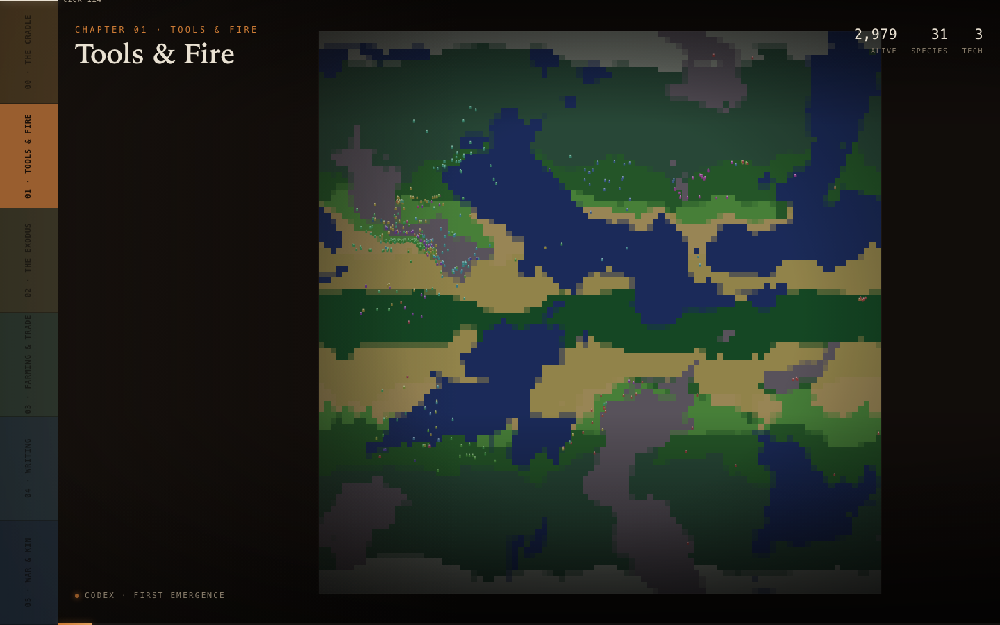
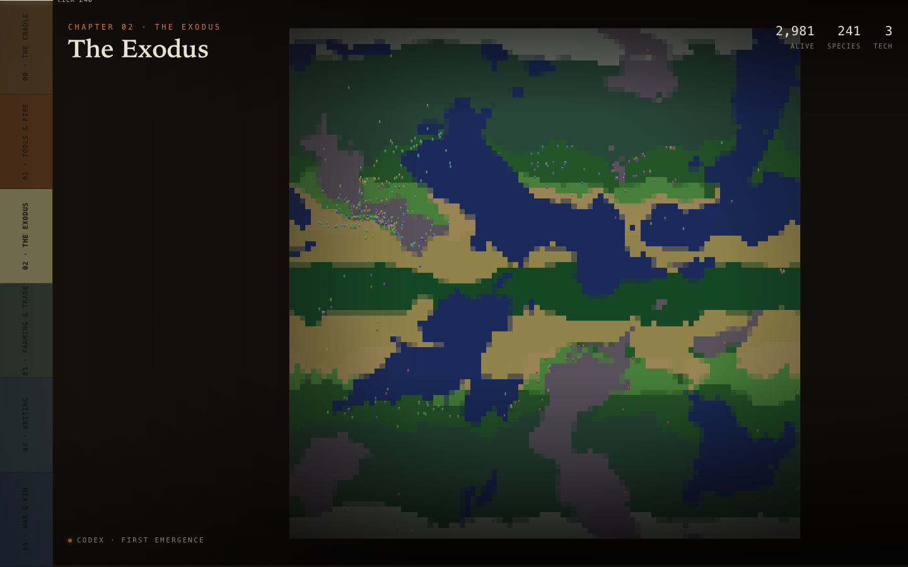
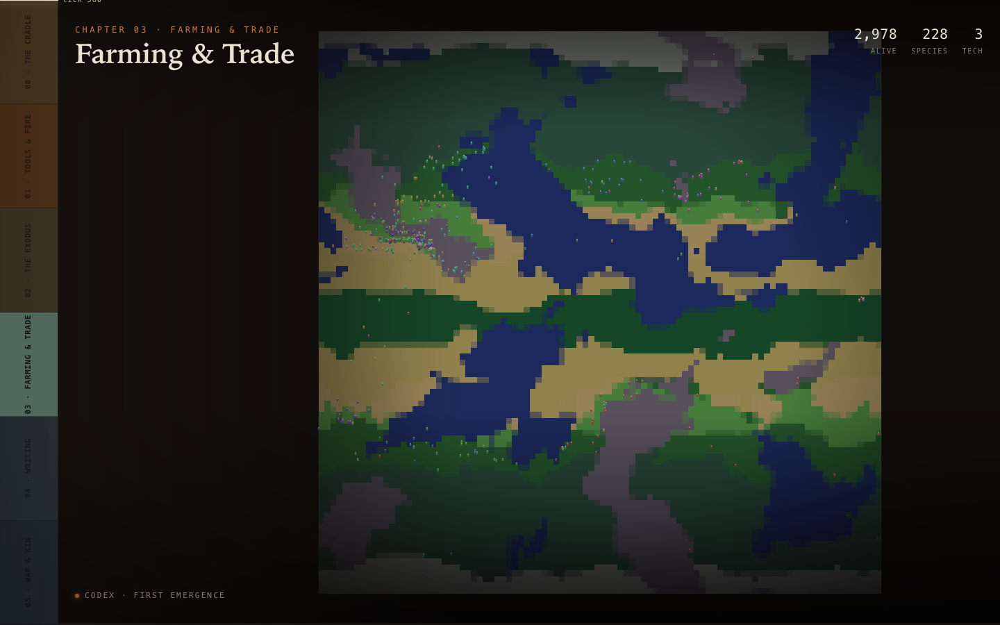
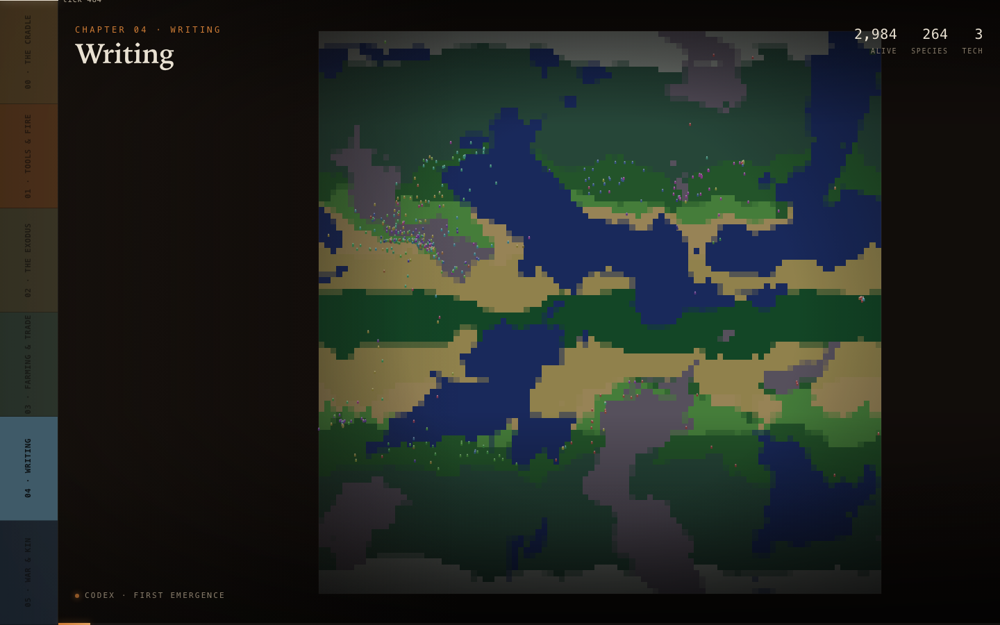
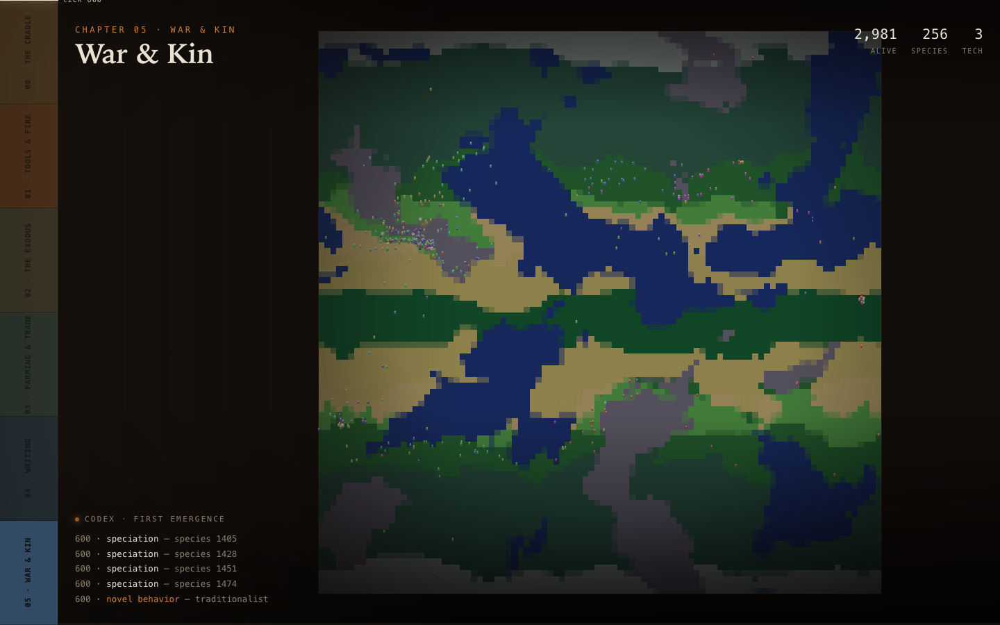

# anabios gallery

Stills from the **[web showcase](../showcase/)** — a browser-native, animated replay of
a single deterministic run (`out-of-africa-saga`, seed 318). Each shot is one era of the
same run: the world is the sim's real Whittaker biome map, the dots are living hominins,
and the codex on the left streams the actual "first emergence" events the detectors fired.

Everything here is reproducible — re-run the seed and you get the same history, frame for
frame (state hash `0xa887a0fe76a7aa72`). To see it move, open `showcase/index.html`; to
regenerate the underlying replay, see [`showcase/README.md`](../showcase/README.md).

Captured at 1440×900 from `showcase/index.html` (deep-link `?era=N`, scrolling prose hidden).

---

### The hero

The title over the dimmed world. No genomes are scripted and no civilization is authored —
fire, migration, farming, writing, and war all emerge from a few hundred hominins given
hunger, a tiny evolvable mind, and a warming world.

### 00 · The Cradle

A founding population of ~1,180 wakes in the savanna, clustered in one region. Everything
that follows is already latent in fifty numbers per genome — the first inventions have only
just begun to surface (`invention adopted`, `novel behavior`).

### 01 · Tools & Fire

The first techniques spread as memes — taught, not inherited. The population has climbed
past the founding band and started to fan out across the biomes.

### 02 · The Exodus

Pressure pushes lineages across the torus. Isolation does the rest: dialects drift and
populations split until the detectors fire `speciation`, and the species count climbs.

### 03 · Farming & Trade

Some settle. Nearly 3,000 hominins now spread across every biome; surplus invents the first
economy — settlements and markets stitched together across the map.

### 04 · Writing

Culture stops decaying between generations and begins to accumulate. Meme sweeps and cultural
radiation ripple across the world faster than any single life could carry them.

### 05 · War & Kin

Scarcity finds the fault lines — ember rings mark raids and clashes at the borders, while
the tightest kin-bands survive to seed the next age. ~290 species now share the world.
